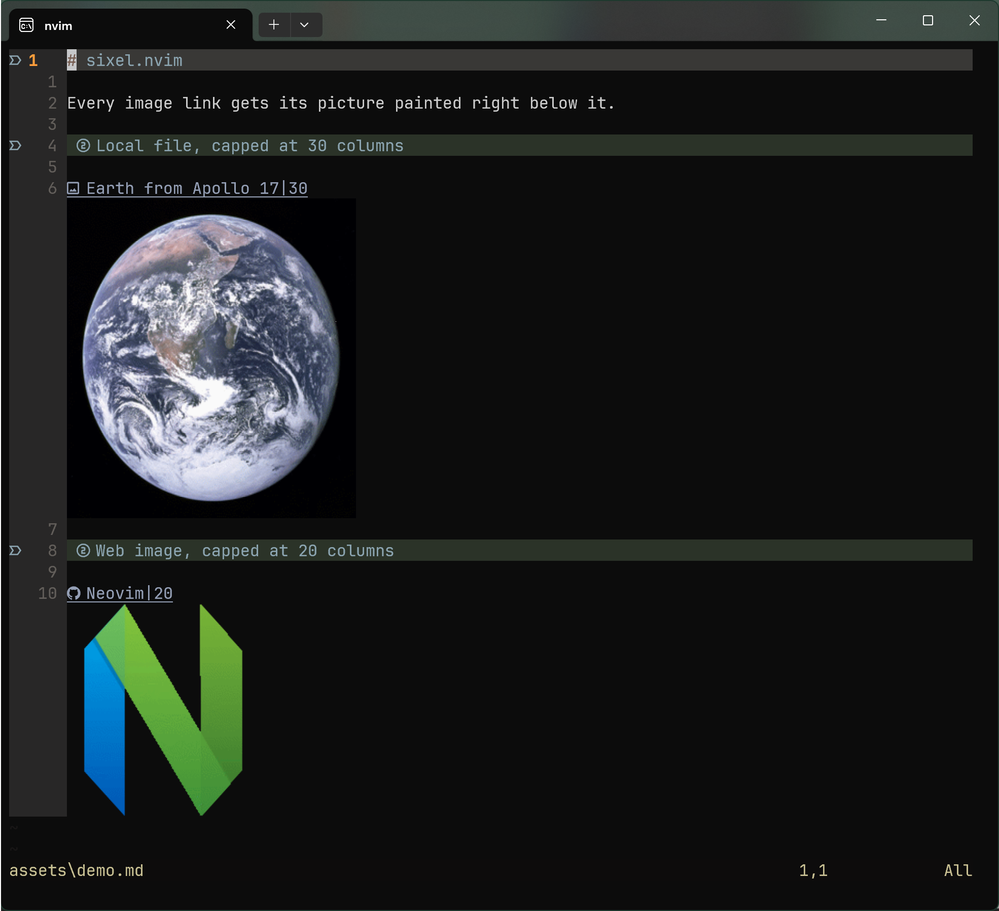

# sixel.nvim

Inline images in Markdown buffers, for Neovim running in Windows Terminal.



Open a `.md` file and every `` line gets its picture painted right
below it, as sixel graphics. Local files, `http(s)` URLs and ```` ```mermaid ````
blocks all work. No daemon, no Python, no multiplexer tricks: the plugin reserves
blank virtual lines under the link and writes the sixel data straight to the
terminal.

## Requirements

- Neovim 0.12 or newer (`nvim_ui_send`).
- Windows Terminal 1.22 or newer (the first release with sixel support).
- An encoder:
  - Windows: PowerShell 7 with the [Sixel](https://github.com/trackd/Sixel) module,
    `Install-Module Sixel`.
  - WSL: ImageMagick 6, `sudo apt install imagemagick` (the `convert` command).
- `curl`, for URL images. Ships with Windows 10+ and every distro.
- Optional: [mermaid-cli](https://github.com/mermaid-js/mermaid-cli) (`mmdc`) to
  render mermaid blocks. Without it the blocks are left as plain text.

## Install

With [lazy.nvim](https://github.com/folke/lazy.nvim):

```lua
{ "Kaz4510/sixel.nvim", opts = {} }
```

The defaults, and what they mean:

```lua
{
  "Kaz4510/sixel.nvim",
  opts = {
    cell = { w = 10, h = 20 }, -- pixel size of one terminal cell, see below
    max_rows = 15,             -- tallest image in rows, keep it under the window height
    max_cols = 80,             -- widest image in columns, clamped to the window width
    debounce_ms = 150,         -- pause before repainting after a scroll
    urls = true,               -- download http(s) images into the cache and render them
  },
}
```

Images are never enlarged past their native size, so large caps only matter for
large pictures.

### Cell size

Neovim cannot ask the terminal how big a cell is, so `cell` is a knob. Measure it
once in Windows Terminal, after installing the Sixel module, and again after a
font change:

```powershell
[Sixel.Terminal.Compatibility]::GetCellSize()
```

## Usage

| Markdown | Result |
| --- | --- |
| `` | Painted below the line. Paths are relative to the file, or absolute. |
| `` | Paths with spaces, also as `my%20picture.png` or with a trailing `"title"`. |
| `` | Width capped at 40 columns. |
| `` | Downloaded once into `stdpath("cache")/sixel`, then painted. |
| ```` ```mermaid ```` block | Rendered with `mmdc` and painted below the closing fence. |

`:SixelRefresh` drops the encode cache, re-downloads URL images and repaints. Use
it after editing a picture on disk.

Images hide while you are in insert mode and come back when you leave it.

Try it on [assets/demo.md](assets/demo.md).

## How it works

1. Scan the buffer for image links and mermaid fences.
2. Encode each picture to sixel with an external process, asynchronously. Results
   are cached per path and size.
3. Reserve the image's height in blank virtual lines under the link, with an
   extmark, so the text flows around the picture and the mark follows edits.
4. After every scroll, resize or edit, compute the screen position of each
   reserved block and write the sixel data there with `nvim_ui_send`.
5. When a picture moves or leaves the screen, clear the terminal with `:mode`.
   Its `ESC[2J` is the only clear Windows Terminal treats as erasing images.

## Limitations

- Windows Terminal only, on purpose. The plugin checks `WT_SESSION` and stays
  dormant elsewhere, so it is safe to keep in a config shared with other
  terminals. Other sixel terminals would need a different erase strategy.
- `max_rows` must be smaller than the window height. A picture that does not fit
  on screen in one piece is not painted.
- Sixel is 8-bit colour with dithering. Photos look fine, gradients less so.

## Made with Claude

This plugin was built in [Claude Code](https://claude.com/claude-code) sessions.
Claude did the research into how Windows Terminal handles sixel (which clear
sequence erases images, how the PowerShell Sixel module sizes its output),
proposed the rendering approach, wrote the Lua, and debugged the paint
artifacts, with me steering, testing each round on Windows and WSL, and
deciding what stayed. It also wrote this README, automated the demo
screenshot, and handled the git commits and the push to GitHub. Every commit
carries a `Co-Authored-By` trailer for it.

## Credits

Demo photo: *The Blue Marble*, taken by the Apollo 17 crew, NASA, public domain.

MIT license.
