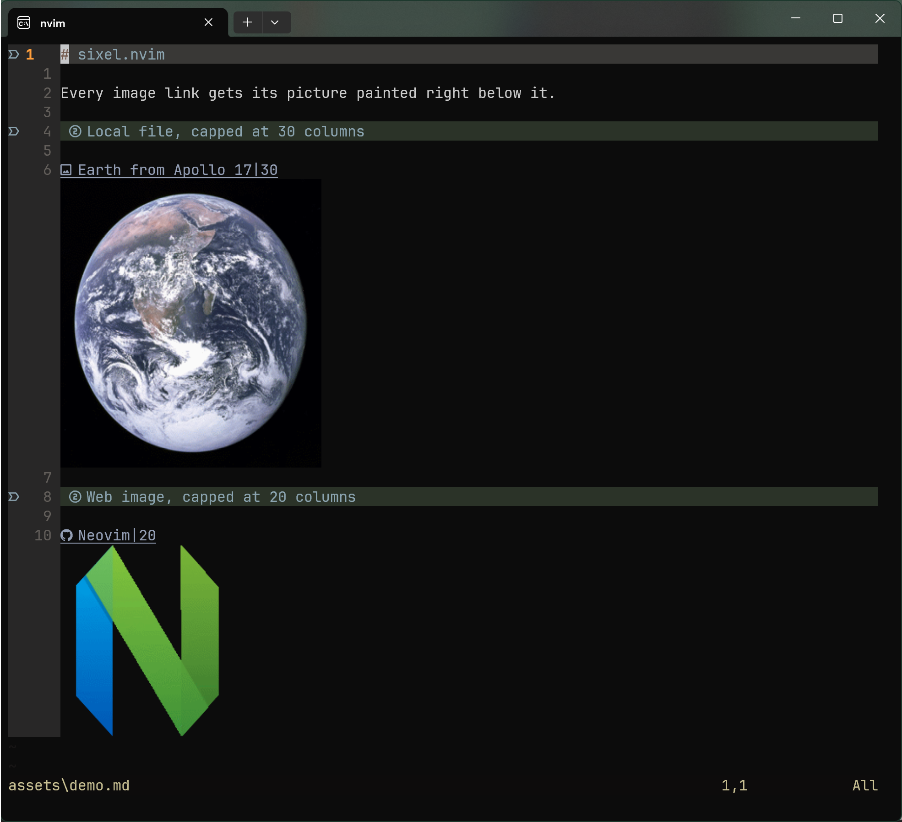

# sixel.nvim

Inline images in Markdown buffers, for Neovim running in Windows Terminal.



Run `:SixelRead` in a markdown buffer and it opens as a full-screen reader, one
page at a time, with every `` painted right below its line as sixel
graphics. Local files, `http(s)` URLs and ```` ```mermaid ```` blocks all work.
Flip pages instead of scrolling: a page never moves, so the terminal never has
stale pixels to clean up. No daemon, no Python, no multiplexer tricks.

## Requirements

- Neovim 0.12 or newer (`nvim_ui_send`).
- Windows Terminal 1.22 or newer (the first release with sixel support).
- An encoder:
  - Windows: PowerShell 7 with the [Sixel](https://github.com/trackd/Sixel) module,
    `Install-Module Sixel`.
  - WSL: ImageMagick 6, `sudo apt install imagemagick` (the `convert` command).
- `curl`, for URL images. Ships with Windows 10+ and every distro.
- Optional: [mermaid-cli](https://github.com/mermaid-js/mermaid-cli) (`mmdc`) to
  render mermaid blocks. Without it the blocks are left as plain text.

## Install

With [lazy.nvim](https://github.com/folke/lazy.nvim):

```lua
{
  "Kaz4510/sixel.nvim",
  opts = {},
  keys = { { "<leader>mr", "<cmd>SixelRead<cr>", desc = "Read markdown with images" } },
}
```

The defaults, and what they mean:

```lua
{
  "Kaz4510/sixel.nvim",
  opts = {
    cell = { w = 10, h = 20 }, -- pixel size of one terminal cell, see below
    max_rows = 15,             -- tallest image in rows, also capped by the screen height
    max_cols = 80,             -- widest image in columns, clamped to the screen width
    urls = true,               -- download http(s) images into the cache and render them
  },
}
```

Images are never enlarged past their native size, so large caps only matter for
large pictures.

### Cell size

Neovim cannot ask the terminal how big a cell is, so `cell` is a knob. Measure it
once in Windows Terminal, after installing the Sixel module, and again after a
font change:

```powershell
[Sixel.Terminal.Compatibility]::GetCellSize()
```

## Usage

| Markdown | Result |
| --- | --- |
| `` | Painted below the line. Paths are relative to the file, or absolute. |
| `` | Paths with spaces, also as `my%20picture.png` or with a trailing `"title"`. |
| `` | Width capped at 40 columns. |
| `` | Downloaded once into `stdpath("cache")/sixel`, then painted. |
| ```` ```mermaid ```` block | Rendered with `mmdc` and painted below the closing fence. |

`:SixelRead` opens the reader at the page holding the cursor line.

| Key | Action |
| --- | --- |
| `n`, `<Space>`, `<PageDown>` | Next page |
| `p`, `<BS>`, `<PageUp>` | Previous page |
| `q`, `<Esc>` | Back to the source, cursor on the first line of the page |

`:SixelRefresh` drops the encode cache, re-downloads URL images and redraws the
open page. Use it after editing a picture on disk.

Try it on [assets/demo.md](assets/demo.md).

## How it works

1. Scan the buffer for image links and mermaid fences.
2. Encode each picture to sixel with an external process, asynchronously, sized
   for the screen. Results are cached per path and size.
3. Cut the document into pages: add lines (a wrapped line counts as several
   rows, an image adds its height) until the next one would not fit the screen.
4. Show a page in a full-screen float, with a real blank line per image row.
   Clear the terminal with `:mode` (its `ESC[2J` is the only clear Windows
   Terminal treats as erasing images), then write every image of the page with
   `nvim_ui_send`. Nothing on the page ever scrolls, so nothing needs repainting
   until the next flip, a resize or a `:` command.

## Limitations

- Windows Terminal only, on purpose. The plugin checks `WT_SESSION` and stays
  dormant elsewhere, so it is safe to keep in a config shared with other
  terminals. Other sixel terminals would need a different erase strategy.
- The whole document is encoded when the reader opens, so the first open of a
  document with many images takes a moment. Later opens hit the cache.
- The reader is for reading. Edit in the source buffer and reopen it.
- Sixel is 8-bit colour with dithering. Photos look fine, gradients less so.

## Credits

Written by [Rishi](https://github.com/Kaz4510) together with Claude, in
interactive [Claude Code](https://claude.com/claude-code) sessions.

- **Rishi** researched the approach with Claude, wrote the Lua by hand from the
  algorithm the two settled on, tested each round on Windows and WSL, and
  decided what shipped.
- **Claude** researched how Windows Terminal handles sixel (which clear sequence
  erases images, how the PowerShell Sixel module sizes its output), worked out
  the rendering algorithm with Rishi, helped chase the paint artifacts, and
  wrote this README, the demo screenshot automation, the commit messages and
  the push to GitHub. Commits carry a `Co-Authored-By` trailer for it.

The page-flip reader replaced Rishi's inline renderer. Rishi chose the reader
design (a full-screen view, pages that fill the screen, a key to open it) and
Claude wrote its Lua and tests and tested it in Windows Terminal. The scanning,
encoding, mermaid and URL code it builds on is still Rishi's.

Demo photo: *The Blue Marble*, taken by the Apollo 17 crew, NASA, public domain.

MIT license.
